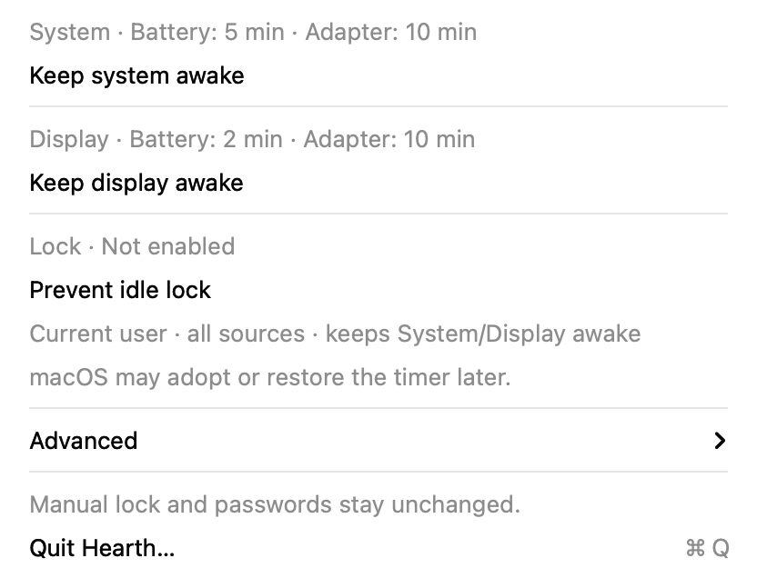
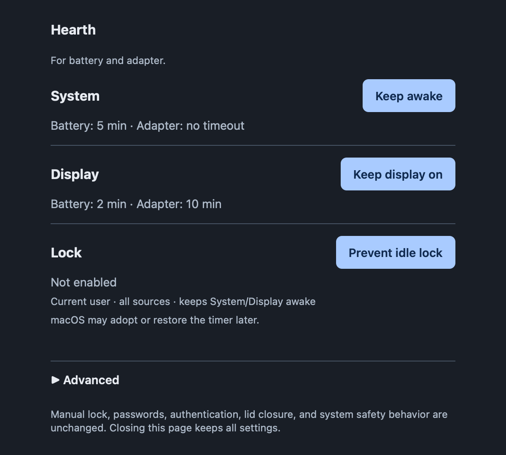

# Hearth

Keep your Mac or display awake, and configure idle-lock prevention—from the menu bar, Terminal, or a local browser.

**[Installation](docs/installation.md) · [Releases](https://github.com/girishkvs/hearth/releases) · [Source](https://github.com/girishkvs/hearth) · [Usage](docs/usage.md)**

> **1.2.0** · [Release notes and platform limits](docs/releases/1.2.0.md).



*Actual primary menu with isolated sample data.*

## Three controls, clear scope

| Control | What it does | Default and scope |
|---|---|---|
| **System** | Prevents idle system sleep | Default for `hearth on`; battery and adapter selected |
| **Display** | Prevents idle display sleep | Explicit opt-in; does not by itself prevent locking |
| **Lock** | Configures idle-lock prevention | Current user, all available power profiles; requires System and Display awake |

Each control has its own Restore action. Lock borrows settings already awake;
**Restore Lock** releases only its changes. Choose power sources and timeouts under **Advanced**.

## Install

Requires **macOS 13+**. Source builds need **Xcode 26+ / Swift 6.2+**.
Hearth is source-first: local packages are **unsigned**, their code is **ad-hoc signed**,
and they are **not notarized**. Use only source and artifacts you trust.

From a clean, reviewed 1.2.0 checkout, build into a new directory:

```sh
out="$PWD/dist/hearth-1.2.0-reviewed-local"
scripts/prepare-release.sh --output-dir "$out"
package="$out/hearth-1.2.0-macos-$(uname -m)-local-setup.pkg"
```

Choose **one** installation route for that exact package:

```sh
scripts/install.sh --gui --package "$package"    # Native Installer
# Or, in an interactive Terminal:
# scripts/install.sh --cli --package "$package"
```

Setup asks for administrator approval; everyday controls do not. **No Automation
setup is needed.** Building installs nothing. See [source/archive installation](docs/installation.md#build-from-source)
and [migration](docs/migration.md) before updating an existing installation.

Open **`/Applications/Hearth.app`**, then click the flame icon in the menu bar.
Hearth has no Dock icon. The Terminal command is installed at **`/usr/local/bin/hearth`**.

## Use it

```sh
hearth status                           # Current settings and restore state
hearth on                               # System only, battery and adapter
hearth on --setting display             # Display only
hearth lock on                          # Current-user Lock + System/Display
hearth lock restore                     # Release only Lock-owned changes
hearth restore                          # Restore remaining System changes
hearth restore --setting display        # Restore remaining Display changes
hearth web                              # Open local browser controls
```

Use `--power battery` or `--power adapter` for System/Display actions.
Lock always covers all available profiles. [Full command reference](docs/usage.md#terminal-commands).



*Actual web controls with isolated sample data.*

The web server runs only when requested. Keep its private launch link to yourself;
Ctrl+C stops the server without restoring settings.

## Restore and limits

- Restore changes only settings owned by Hearth, preserving pre-existing awake settings
  and detected external changes. Quitting does not automatically restore them.
- **Configured** means settings were saved and read back. **macOS may adopt or restore
  the timer later**; it is not an immediate runtime guarantee.
- Manual Lock Screen, password requirements and grace delay, managed policy, lid-close
  sleep and system safety remain unchanged. There is no unlocked-screen-off mode.
- Unconfirmed writes retain their recovery records and block unsafe retries.
  Do not clear state to reset them; see [recovery guidance](docs/troubleshooting.md#lock-has-an-unconfirmed-screen-saver-write).

## Documentation

| Guide | Find |
|---|---|
| [Installation](docs/installation.md) · [Migration](docs/migration.md) | Source builds, GUI/Terminal setup, updates and removal |
| [Usage](docs/usage.md) · [Troubleshooting](docs/troubleshooting.md) | Controls, commands, saved settings and recovery |
| [Design](docs/design.md) · [Privacy](docs/privacy.md) · [Security](SECURITY.md) | How Hearth works and what it stores |
| [Development](docs/development.md) · [Contributing](CONTRIBUTING.md) · [Releasing](docs/releasing.md) | Build, test and release workflows |
| [Changelog](CHANGELOG.md) · [1.2.0 notes](docs/releases/1.2.0.md) | Features, acceptance evidence and platform limits |

## License

[MIT](LICENSE), copyright 2026 Girish Konda. [Third-party notices](docs/third-party-notices.md).
