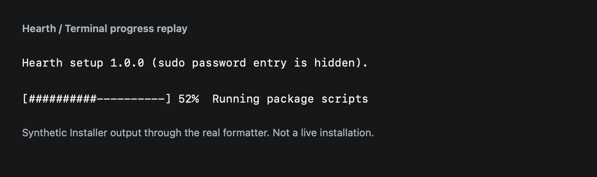
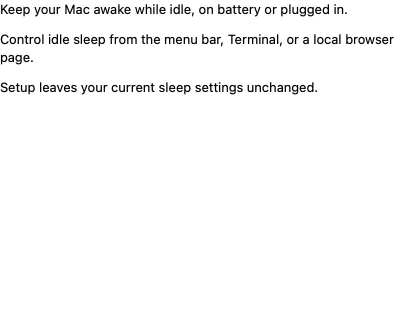
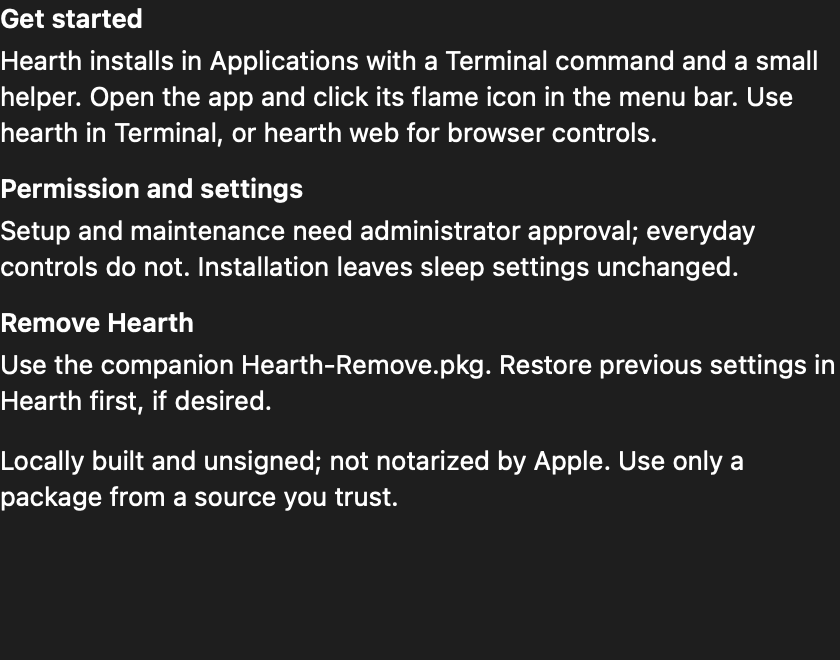
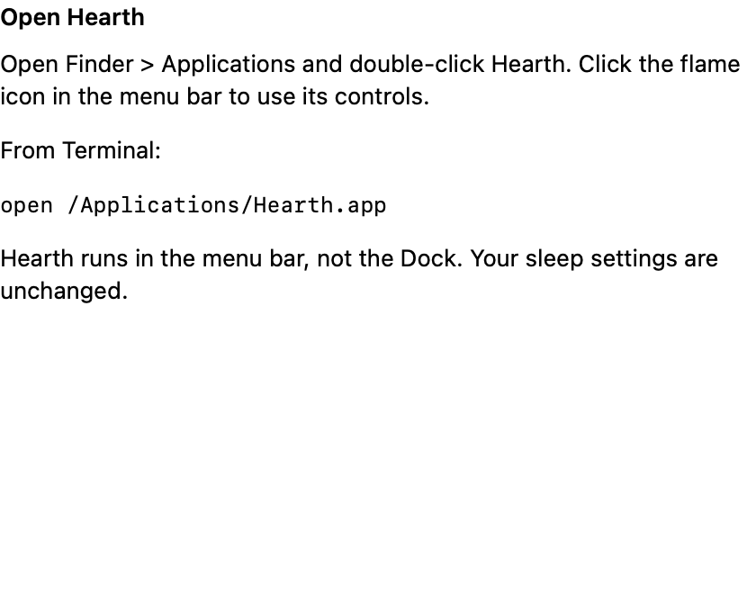

# Install, update, and remove

Hearth 1.0.0 controls **system idle sleep only**. Display-off and screen locking
remain under macOS settings.

## Requirements

- macOS 13+ deployment target; local validation used Apple silicon/macOS 26.5.1.
- For source builds: Xcode 26+ with Swift 6.2 or later and an accepted Xcode license.
  Pinned dependencies require Swift 6.2; Command Line Tools alone may not supply
  the AppKit/WebKit test environment.
- A normal user account for build/operation; administrator approval only for
  explicit installation, update, or removal.

The source repository is `https://github.com/girishkvs/hearth`. Release packages
are locally built, unsigned, and **not notarized**. Trust the source/artifact before
authorizing it. Checksums detect corruption; they do not authenticate a publisher.

## Build from a clean source checkout

```sh
git clone https://github.com/girishkvs/hearth.git
cd hearth
git checkout v1.0.0
scripts/prepare-release.sh
```

That command builds, validates normal packages, and prepares source/checksum
artifacts under `dist/hearth-1.0.0-macos-$(uname -m)-local/`. Nothing is installed
or registered. For an extracted source archive without `.git`, use:

```sh
swift build -c release
scripts/package-installer.sh
```

Set `SOURCE_DATE_EPOCH` if you need a fixed package build identifier. Git checkouts
default to the commit timestamp; source archives without Git default to build time.
See [releasing](releasing.md) for repeatable release inputs and limitations.

## Choose GUI or Terminal setup

Both entrypoints validate and install the **same package**, using Apple's Installer
and the same Hearth maintenance backend. Neither runs a power-setting command.

```sh
# Native wizard:
scripts/install.sh --gui

# Real Terminal installation, not a GUI launcher:
scripts/install.sh --cli
```

The Terminal route invokes only
`sudo -- /usr/sbin/installer -verboseR -pkg <package> -target /`.
Run it directly in one interactive Terminal, without piping to `tee` or redirecting
input/output. Enter credentials only at the normal sudo prompt: password typing
shows no characters, then press Return. The app/web page never collects them.
The default display is one updating ASCII bar with the current native phase and
rounded, reported percentage. Repeated phases do not scroll. Unknown progress stays
unknown; no elapsed-time estimate is invented, and success is shown only after
Installer exits successfully. The native exit status is preserved.

Only Installer's stdout is formatted. sudo still reads from your Terminal and its
authentication prompt/error stream is not captured. Keep the window open until
the final success/failure line. There is no fallback from power controls to setup.

For raw diagnostics, choose `scripts/install.sh --cli --verbose` (also supported
by `uninstall.sh`). This is an explicit installation mode, **not** a reason to
repeat a failed or uncertain update. Check that attempt's Installer log first.



*Synthetic native Installer output passed through the production formatter. This
is a replay preview, not another live installation. Refresh it with
`scripts/capture-docs.sh`; run the safe replay coverage with
`scripts/tests/installer-progress-tests.sh`.*

The default package is the current version/architecture artifact, not an old
`dist/Hearth-Setup.pkg`. For a downloaded or relocated package, pass its absolute path:

```sh
scripts/install.sh --gui --package "/absolute/path/hearth-1.0.0-macos-arm64-local-setup.pkg"
scripts/install.sh --cli --package "/absolute/path/hearth-1.0.0-macos-arm64-local-setup.pkg"
```

Use the filename for your actual architecture. Verify `SHA256SUMS.txt` before
opening downloaded artifacts. `--open-installer` remains a GUI alias; no arguments
or `--help` prints guidance without installing.
Setup and removal declare the single architecture verified against their packaged
Mach-O binaries; an Apple silicon build does not require Rosetta for installation.



*Rendered preview of the actual 1.0.0 Introduction resource, not a screenshot of
Apple's Installer or a claim that installation completed. The native wizard adds
its own welcome heading and exact MIT License step.*



*Actual Read Me resource preview. Apple's host remains named Installer in the Dock
and menu bar; the native window is Install Hearth.*

## After setup

In Finder, open **Applications** and double-click **Hearth**. Or run this as your
normal user, without sudo:

```sh
open /Applications/Hearth.app
```

Hearth appears as a **flame icon in the menu bar, not in the Dock**. Click the
flame to see its controls. Setup does not automatically launch the app; you do
not need Spotlight to open it. Terminal/browser controls are also available:

```sh
/usr/local/bin/hearth status
/usr/local/bin/hearth web
```

Confirm **Helper ready** and inspect actual values before changing anything.
Setup does not change sleep settings, shell startup files, or app login items.
The helper is on-demand through launchd. It never changes power merely by starting.



*Rendered preview of the actual Installer conclusion resource, not a completed
installation screenshot. It directs you to the installed app without relying on
Spotlight.*

| Item | Location |
|---|---|
| App and CLI | `/Applications/Hearth.app` |
| Command link | `/usr/local/bin/hearth` |
| Helper | `/Library/PrivilegedHelperTools/dev.girishkvs.hearth.helper` |
| Service definition | `/Library/LaunchDaemons/dev.girishkvs.hearth.helper.plist` |
| Protected enrollment/inventory | `/Library/Application Support/Hearth/` |
| Your restore state | `~/Library/Application Support/Hearth/state.json` |

## Update

Restore managed settings first if you want them restored. Close the app and stop
your web server, then explicitly run the **new version's** setup package through
its matching GUI or CLI wrapper. Exact code pinning means a rebuilt client is not
silently trusted. Installed signatures, inventory, ownership and active-operation
locks must validate before replacement. Updates preserve per-user restore state.

Private development builds used `2.0.*` labels; this public release uses1.0.0.
The scripts-only updater uses verified Hearth metadata, not an assumed Apple
receipt or version-based overwrite shortcut. Busy, foreign or modified state is
refused, not force-repaired.

## Remove

Removal does not restore or change power settings. If desired, use Restore in a
ready Hearth app first and wait for success. Then explicitly choose:

```sh
scripts/uninstall.sh --restored --gui
scripts/uninstall.sh --keep-settings --cli
```

Both modes use the current `*-remove.pkg`; `--package /absolute/path/...-remove.pkg`
supports downloaded artifacts. The choices mean “I already restored” or “keep
settings,” not an automatic power operation. User state and the permanent
maintenance lock are retained. The wrapper never invokes a potentially older CLI.

Do not use an old private repair-enabled package as a normal update. See
[troubleshooting](troubleshooting.md) when a safety check refuses maintenance.
