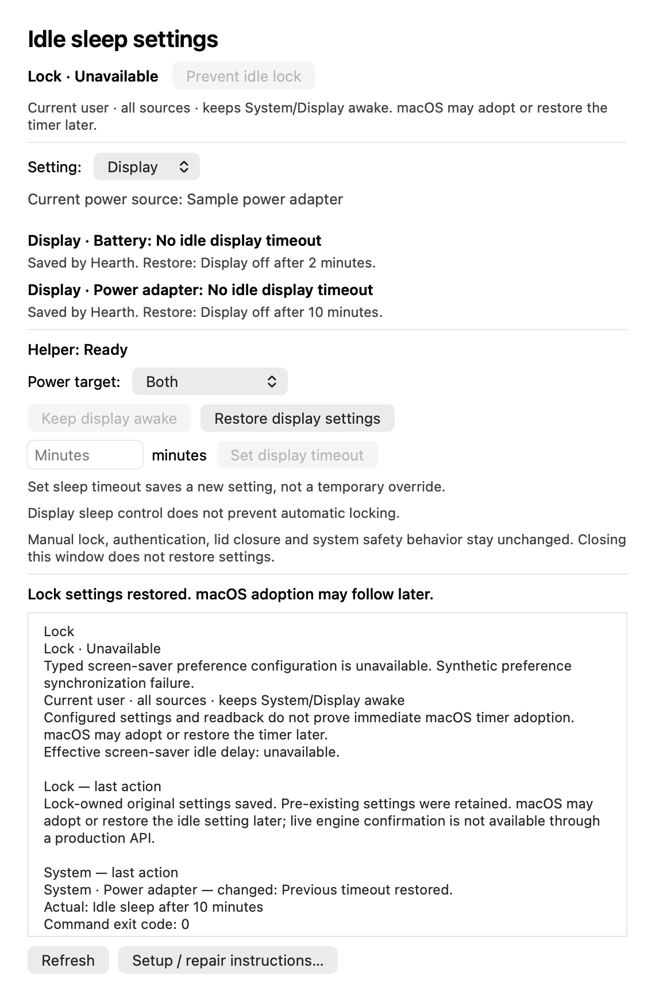
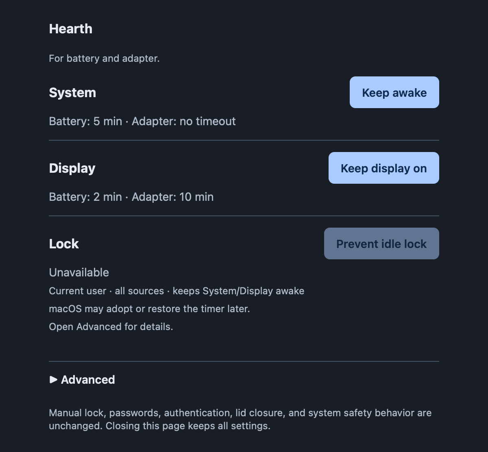
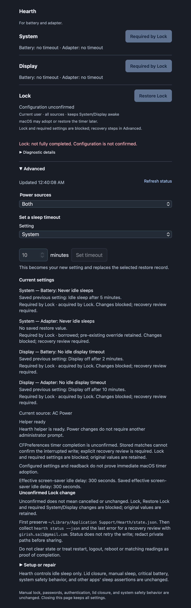

# Troubleshooting

## I cannot find Hearth after installation

Open Finder > Applications and double-click Hearth, or run
`open /Applications/Hearth.app` as your normal user. It is a menu-bar app: look for
the flame icon, not a Dock icon or ordinary application window. Setup does not
launch it automatically.

If Finder shows the bundle and it opens but Spotlight cannot find it, that is a
separate discovery/indexing issue, not proof the app is absent. Launch Services
registration and Spotlight metadata are different. An indexing-status error does
not by itself prove indexing is disabled. Hearth does not reset either database,
rebuild the system index, or change your Spotlight/privacy settings. Report the
exact result rather than reinstalling or globally reindexing blindly.

## The display went dark or the session locked

Hearth's **System** control does not change the display idle timeout. In 1.2.0,
explicitly use **Display** (or `hearth on --setting display`) for that timeout.
Neither control alone prevents the screen-saver idle trigger. **Prevent idle lock**
configures that timer along with System and Display awake. **Configured** means
settings were read back, not immediate macOS adoption. macOS may adopt or restore
the timer later. It cannot prevent manual lock, deliberate sleep, lid-close or
system safety behavior and does not provide unlocked screen-off. Hearth does not
disable password protection, lengthen its grace period, or synthesize user activity.

## Lock controls need setup or are unavailable

New Lock operations need no Automation setup. The native app uses public current-user
preferences. System/Display power changes still require the separately installed
helper. If setup/repair is reported, read its actual error; do not reset TCC or
try another application to grant permission.

The native app must be available for CLI/web Lock actions. Those actions may open
the verified installed app, but status never opens it. A helper restart can remove
its in-memory rendezvous; reopen the native app to refresh registration. Do not
replace endpoint files or use a different executable to bypass identity checks.

Lock requires verified absence of relevant idle restrictions. Any
configuration profile, enrollment, unresolved directory/MCX policy, forced saver
setting, automatic logout or unreadable policy evidence blocks activation. This is
deliberately conservative; a false result for one forced preference is not proof
that all managed inactivity limits are absent. Do not remove management or weaken
authentication to make the button available.

A narrowly recognized password-content-only rule is not an idle-timer restriction;
it stays unchanged. Empty/no-explicit user results do not discard inherited node
policy. Real OD errors and unknown policy structures still block the operation.

Lock can also be unavailable on an unmanaged Mac because its timer inherits
preferences from another user/host scope. Writing a current-user/current-host
timer can make macOS choose a different whole preference dictionary, hiding
other inherited settings. Hearth deliberately refuses that change rather than
alter unrelated preferences. See [how inherited settings are protected](design.md#coordinated-lock-control)
and [recovery guidance](#restore-lock-is-disabled-after-settings-change). Do not
delete preferences or weaken policy to make the control available.

## System or Display says Required by Lock

When available, use the directly offered **Restore Lock** action. It restores only settings acquired
by Lock; settings already awake and their pre-existing restore records remain intact.
Then independent System/Display controls become available. There is no hidden
automatic change to another control and no need to discover a multi-step sequence.
If Restore Lock is disabled, read the error in Advanced. An unconfirmed write or
changed preference context keeps the recovery record rather than allowing a blind restore.

## Restore Lock is disabled after settings change

If Hearth's stored timer is still zero but other captured preference context has
changed, Hearth reports restore needed and disables restoration. It keeps the
timer baseline and power dependencies: a context-only change does not prove that
another tool replaced the timer. No write or release is performed. Preserve the
journal and reported error for review; do not clear state, change the context back
blindly, or replay an earlier snapshot.

## Preference reads fail, or an older app reports System Events errors

Earlier development candidates used System Events and could report **System Events
did not report success** because its declared `delayInterval` accessor failed on
macOS 26.6.2. The corrected 1.2.0 candidate replaced that path with public
CFPreferences and passed installed-product acceptance. If an older build still
reports that error, use the matching reviewed update rather than repeating consent.

Preference read, synchronization, type or context failures remain visible and disable Lock without
offering Automation setup. Safe independent System/Display controls remain
available. No unavailable state is relabeled Configured.



*The existing Details and controls panel with isolated sample data. Lock
unavailability does not request Automation setup.*



*Actual local UI with a synthetic preference failure, not a live lock or
permission test.*

Lock requires a valid typed configuration and verified policy readiness. Original
absence is valid when the effective engine default/context can be established; it
must remain absence on restoration, not be normalized to a stored default or zero.
The backend reads the installed registered-default resource rather than hardcoding
1200. Do not substitute a guessed key, reset TCC, restart System Events or disable a
guard. Preserve the error and OS version for review. No saver configuration is a
user prerequisite. See [the public backend](design.md#coordinated-lock-control).

A bounded approved diagnostic showed new loginwindow adoption of zero after
several minutes on macOS 26.6.2. A later read-only observation after normal user
activity showed return to the engine default after exact absence restoration.
That diagnostic is separate from the subsequently completed installed
LockOn/RestoreLock cycle. Neither establishes immediate or cross-macOS runtime
behavior, a 20-minute no-lock result or reboot behavior.
[Release notes](releases/1.2.0.md) preserve both evidence sets and their limits.

## Distinguishing lock, display-off and system sleep

These are different events. Scoped existing loginwindow logs on the test machine
identified a previous `DisplayDim` lock, a later `ScreenSaverIdleLaunch` sequence,
and a separate `DirectLock` request. The idle sequence explicitly followed a
1200-second idle check and called the lock-screen path; it was not inferred from
missing power-log entries or from whether a saver had been configured by the user.

These internal log labels are diagnostic evidence for those recorded events, not
a public configuration API or a continuously verified current state. A historical
1200-second threshold does not identify a writable key or provide a restore
baseline. A missing event in a narrow query does not prove that no lock occurred.
Correlate a specific event with contemporaneous settings before attributing its
cause or claiming an override prevented it.

## Helper not ready

Run `hearth status` as your normal user and read the specific message. `hearth setup`
prints installation guidance. New/modified clients need explicit enrollment through
the matching reviewed package; no normal action elevates or silently reinstalls.

**Hearth update required** means the client/helper protocol is incompatible.
1.2.0 uses IPC 2 for explicit System/Display operations; 1.0.0 uses IPC 1.
Update the complete protected app/helper through matching explicit setup, not
individual executables. See [migration](migration.md) to preserve an active
System override and understand schema 4 downgrade limits. The native user service
also requires matching app/CLI/helper enrollment; helpers from older releases may
not provide its broker interface.

Do not disable Gatekeeper, SIP or signature validation. Unsigned downloaded packages
may be refused by macOS. Prefer a trusted local source build; record the actual
error before changing anything.

## Another operation is running

Wait for the current operation. Do not repeat ON/Restore blindly, delete lock/state
files, or restart a helper while a write may still execute. Preserve the raw journal
and current `pmset -g custom` output. A timed-out reply is not proof nothing changed.

If a process appears stuck, report its exact error, actual profile values, and
whether an operation was pending. Any cancellation/maintenance needs a deliberate
plan that verifies process identity and preserves current settings; do not restore
a historical snapshot just because it exists.

Display and System have independent original/applied values and pending operations
but share one operation lock. A missing display value is unavailable, not zero and
not the system sleep value. Do not invent a baseline or discard a retained record
when a setting/profile temporarily cannot be read.

## Lock has an unconfirmed screen-saver write

**Unconfirmed** is different from the delayed macOS adoption of **Configured**
settings: the preference write itself has not been confirmed. New CFPreferences
transactions keep their uncertain marker; a later matching value is not enough
to clear it or retry.

Keep the saved state. A legacy timed-out Apple Event may still execute after Hearth
stops waiting or exits. Unlike the helper-held power lease, there is no verified public
completion barrier that makes matching readback, repeated reads, elapsed time or
PID disappearance proof of cancellation.

Hearth therefore retains the pending saver marker and blocks further Lock mutation
and conflicting power actions. It does not report Configured or attempt a
blind restore. Automatic recovery for this uncertain case is not implemented; an
explicit recovery investigation must establish actual completion and preserve
current settings before changing state. Do not delete the journal, reset Automation
permission, restart services or replay an old snapshot as a workaround.

For a recovery review, first preserve a private copy of
`~/Library/Application Support/Hearth/state.json`. Then collect `hearth status --json`
and the last reported error. Status can reconcile power records, but does not replay
the saver write or clear its uncertain marker. The raw state retains the saver
original, pending phase and acquired/borrowed power records; JSON and Advanced show
the last observable values, saved originals, blocked dependencies and helper status.
Unavailable readings stay unavailable, not zero.

Share only the relevant evidence with **girish.sai1@gmail.com**, redacting private
paths and any unrelated data. Do not include a private web launch token. This is a
review path, not a Reset action or a promise that restart, logout or reboot settles
the write. Confirmed legacy timer acquisitions without a preference-presence baseline
also stay recovery-only: a matching numeric value cannot convert them into CF
records. New confirmed operations use the usual Restore Lock action, with exact
typed-value/absence restoration and the same delayed-adoption disclosure.



*Actual web Advanced view with isolated sample data; no recovery action or live
screen-saver operation was performed.*

## Setup/update/removal was refused

Read the Installer log for this package and time only. Typical causes include a
foreign command/path, modified signed files, unsafe ownership/ACLs, an active
operation, or interrupted maintenance. Do not force overwrite or fabricate receipts.

Scripts-only installation can be successful without an Apple receipt plist/BOM.
Hearth verifies its protected manifest, complete inventory, signatures and ownership;
optional Apple receipts are checked if present. Unowned installations are not
accepted merely because a receipt is absent.

The old private installer could leave an empty support directory with an inherited
admin group. Normal creation now sets ownership through checked descriptors.
A fingerprint-bound repair exists only for a separately approved unchanged empty
directory; it is not a public release default and must never be a blanket chown.

## Terminal setup seems silent or the window was closed

Run `scripts/install.sh --cli --package "$package"` with the exact reviewed package
directly in one Terminal with no pipes or redirected
input/output. sudo password entry does not echo characters; press Return after
typing. One bar shows actual native progress and the current phase. A pause means
Installer has not reported new progress; Hearth does not fill the bar on a timer.
The final line reports the native exit status. Do not close the window while it
is running. `--verbose` selects raw diagnostics before an explicitly chosen run;
it does not authorize another attempt.

Closing Terminal can disconnect the installer client while macOS continues an
already-authorized package transaction. A missing final report proves neither
success nor cancellation. Do not retry blindly. Check that attempt's entries in
`/var/log/install.log`, then the installed version and read-only status. Preserve
current settings and restore state; do not run ON/Restore to diagnose installation.

## Status and diagnostics

```sh
hearth --version
hearth status --json
/usr/bin/pmset -g custom
/usr/bin/pmset -g batt
```

These commands do not change power or screen-saver settings. `hearth status` may
migrate or reconcile Hearth's own journal, so it is not a byte-for-byte state-preservation
check. Preserve the journal first when investigating an interrupted operation.

For a report, include the command/error, OS and architecture, install/build method,
and relevant profile/state information. Redact usernames, paths you consider private,
browser launch tokens, credentials and unrelated logs. See [security](../SECURITY.md)
for sensitive reports. A report does not authorize anyone to change your settings.
