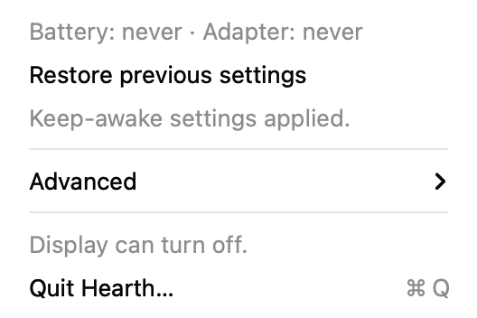
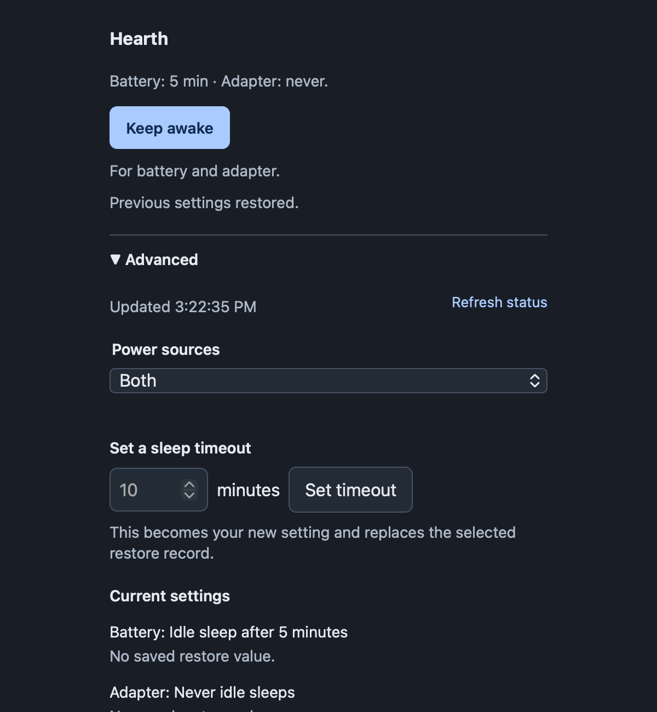
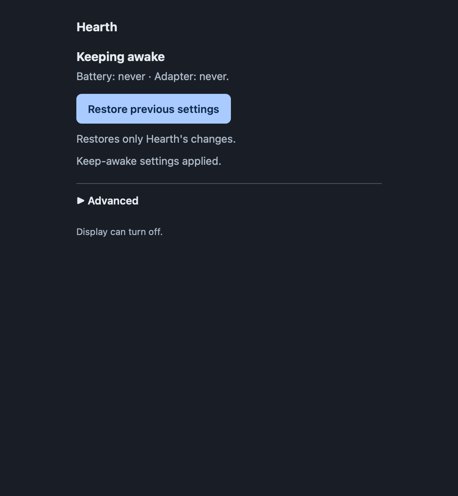

# Use Hearth

## Menu bar

Open Hearth in Applications and click the flame icon. The main menu shows actual
profile values and one primary action. Both is the default target.


*Actual AppKit menu captured from the 1.0.0 code with isolated sample data; no
personal desktop or live power operation was used.*

Choose **Keep awake** to prevent idle system sleep. When Hearth has saved an
override, the primary action becomes **Restore previous settings**.
Targets, explicit timeouts, refresh and detailed status are under Advanced.



*Sample managed state. Restore affects only settings Hearth changed; it does not
force an already-never profile to start sleeping.*

## Terminal commands

| Command | Effect |
|---|---|
| `hearth` / `hearth status` | Actual settings, restore state and helper readiness |
| `hearth status --json` | Structured status for scripts |
| `hearth on` | Prevent idle system sleep on both profiles |
| `hearth restore` / `hearth off` | Restore only Hearth-managed settings |
| `hearth on --power battery` | Battery only |
| `hearth sleep --minutes 10 --power adapter` | Save a new permanent adapter timeout |
| `hearth web [--no-open] [--port N]` | Optional foreground localhost server |
| `hearth setup` | Guidance only; no installer or authorization |
| `hearth --version` | Product version |

`--power` accepts `battery`, `adapter`, or `both`. Sleep minutes must be an integer
from 1 through 2147483647. Use `on` for zero. Unknown/duplicate options fail before
requesting a change. Failures return nonzero status; partial results identify each
profile. Never run the whole CLI as root.

## Web controls

```sh
hearth web
```

Use the private URL printed/opened by Hearth. It contains a per-run capability
token; do not share it or include it in screenshots/issues.


*Actual 1.0.0 web page rendered against an isolated fake backend.*



*Advanced contains target selection, explicit timeout, refresh and diagnostics.*



*Sample active override; the primary action becomes Restore previous settings.*

The server binds only to 127.0.0.1. Ctrl+C stops it without changing power settings.
Closing the page does not stop the foreground process. No server starts during
ordinary app/CLI use.

## Restore is ownership, not a global off switch

If battery was1 minute and adapter already0, Keep awake changes only battery and
saves1. Restore returns battery to1 and leaves adapter0. Repeated activation
does not replace the saved original. An explicit timeout becomes the user's new
setting and clears affected override ownership.

External changes are preserved. Missing or damaged state never creates a guessed
restore value. Unconfirmed operations disable further changes until status is
known; exact error details remain available without filling the main controls.

## What stays unchanged

Hearth 1.0.0 changes only `pmset sleep` for battery/adapter. **Display-off, screen
saver, automatic locking and password requirements stay unchanged.** A dark or
locked display is not proof the system slept. Lid closure, manual sleep, critical
battery, safety behavior, UPS and other apps' assertions are outside Hearth's
control. Settings persist after exit; restoring a timeout does not cancel another
app's independent sleep assertion.
