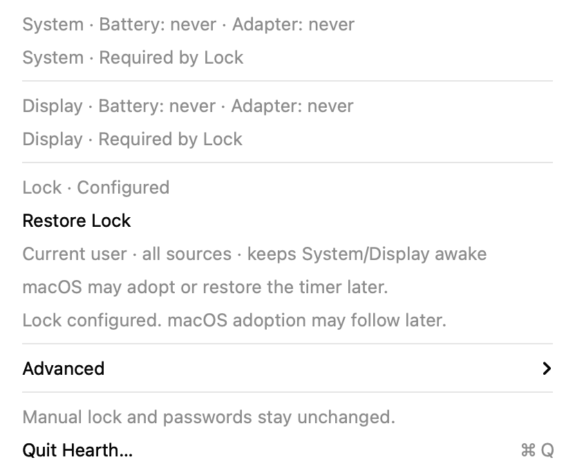
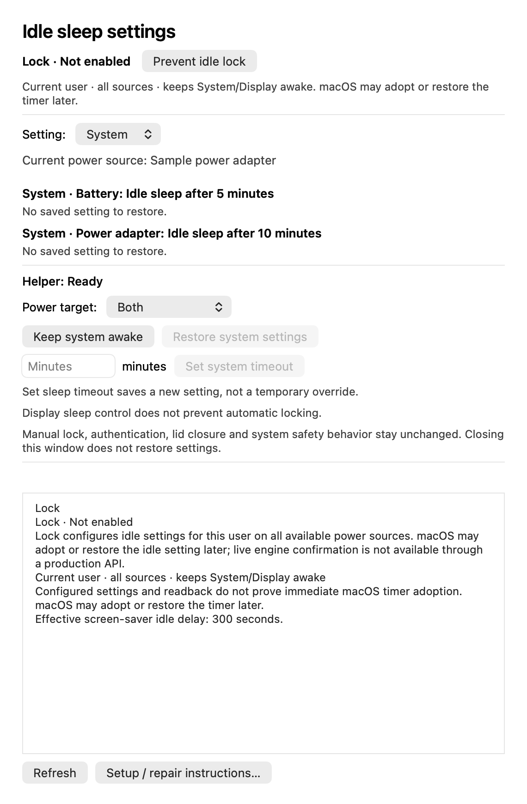
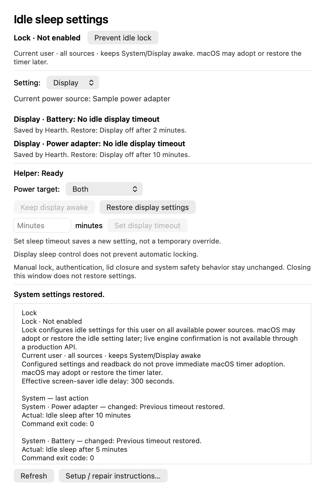
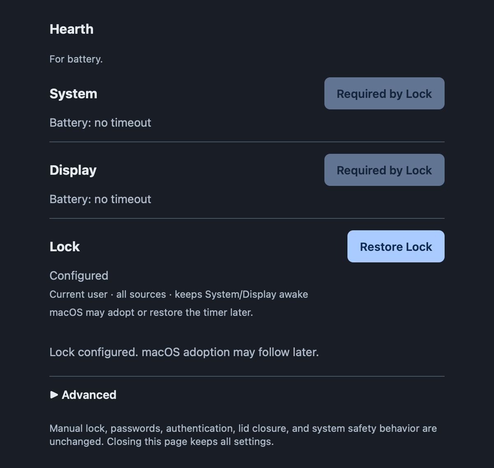
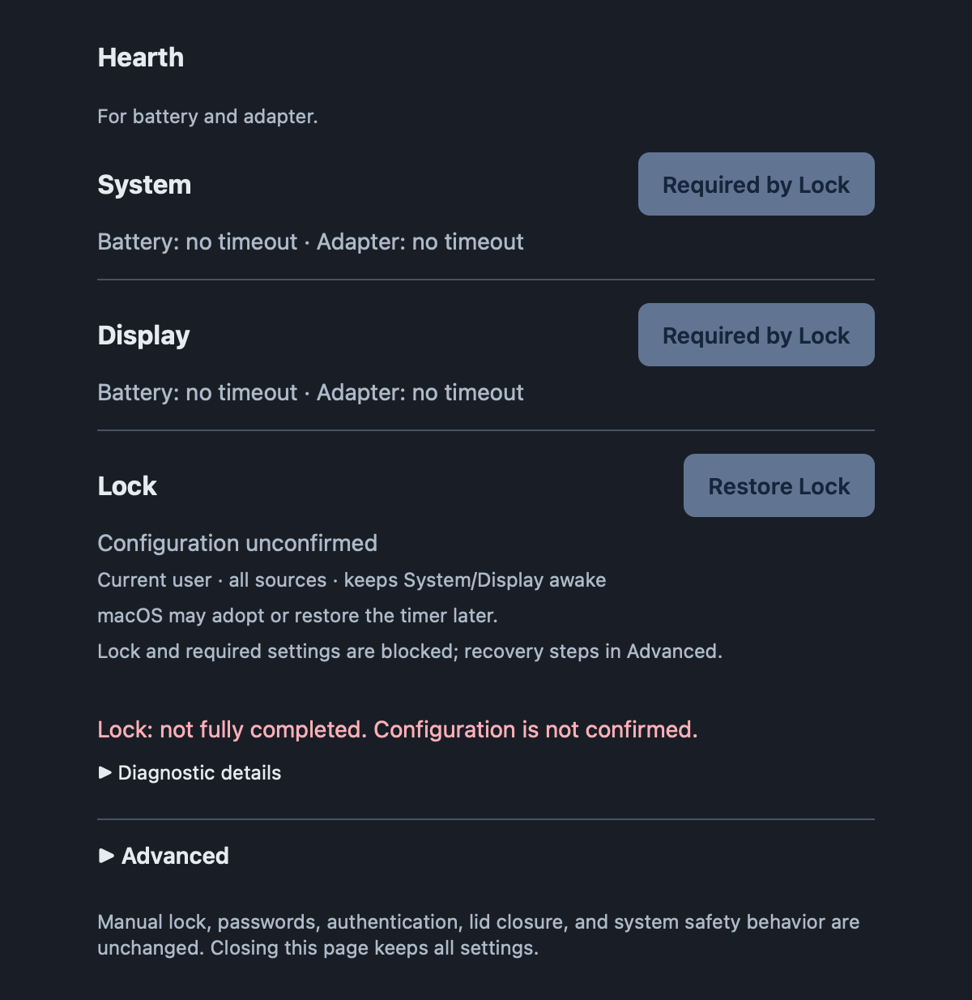

# Use Hearth

This guide covers Hearth 1.2.0. For setup, see [installation](installation.md);
for supported behavior and validation limits, see the [release notes](releases/1.2.0.md).

## Menu bar

Open Hearth in Applications and click the flame icon. The main menu shows actual
state and separate System, Display and Lock actions. Both is the default power target.


*Actual primary menu with isolated sample data.*

Use **System** to prevent idle system sleep, or explicitly choose **Display** to
disable the display idle timeout. Each setting has its own Restore action when
Hearth has saved an override. Both power sources are selected initially; changing
the target affects System/Display actions, not Lock. Targets, explicit timeouts,
refresh and details are under [Advanced](#advanced). Choosing System never opts into Display.

## Prevent idle lock

No Automation setup is needed. The installed helper supports the required power
changes, and the native app handles the current user's timer for all three interfaces.

Preference or policy failures leave Lock unavailable. System/Display controls remain
usable when their own helper, state and observations are safe.

**Prevent idle lock** configures the screen-saver idle timer to zero for this user and keeps
System and Display awake on every available power profile, regardless of the selected
System/Display target. The dependency is shown before activation. Affected controls
then show **Required by Lock** and lead directly to **Restore Lock**.



*Actual primary menu showing Configured Lock with isolated sample data.*

**Configured** means the settings were saved and read back, not that macOS has
already adopted them. **macOS may adopt or restore the timer later.**

**Restore Lock** is one action: restore the prior typed saver value or original
absence, plus only power overrides acquired by Lock. It leaves pre-existing awake values and existing
Hearth System/Display restore records alone. For example, battery System 0 with
original 1 saved before Lock remains exactly that after Restore Lock.
If completion is unconfirmed or the saved preference context has changed,
restoration may be blocked rather than guessed. Keep the saved state and follow
the [recovery guidance](troubleshooting.md#lock-has-an-unconfirmed-screen-saver-write).

This configures ordinary idle triggers, not all locking or sleeping. It does not offer
unlocked screen-off, override manual Lock Screen, change password requirement/grace,
alter automatic logout, bypass managed policy, or defeat lid-close/safety sleep.
Readiness requires a local account with verifiable absence of configuration
profiles, enrollment and relevant directory/MCX restrictions. Any unknown policy evidence
blocks the control. Strictly recognized password-content-only rules remain unchanged.
Installed configuration/restoration and separate consumer adoption/restoration
have been observed on the test Mac. Sustained physical-idle behavior, reboot and
the broader platform/policy matrix are not covered; see
[acceptance evidence and limits](releases/1.2.0.md).

## Advanced

Use **Advanced** for the power target, an explicit System/Display timeout, Refresh,
helper instructions, and **Details and controls**. A positive timeout becomes your
new setting; it is not a temporary override and replaces that setting's restore
record after success.



*The secondary Advanced panel with isolated sample data—not the primary menu.*

System and Display retain separate restore records. For example, after enabling
both and restoring System, Display can remain managed:



*Advanced with Display selected; restoring System did not release Display's settings.*

## Terminal commands

| Command | Effect |
|---|---|
| `hearth` / `hearth status` | Actual settings, restore state and helper readiness |
| `hearth status --json` | Structured status for scripts |
| `hearth on` | Prevent idle system sleep on both profiles |
| `hearth restore` / `hearth off` | Restore only Hearth-managed System settings |
| `hearth on --power battery` | Battery only |
| `hearth sleep --minutes 10 --power adapter` | Save a new permanent adapter timeout |
| `hearth on --setting display` | Disable display idle timeout on both profiles; not a lock exemption |
| `hearth restore --setting display` | Restore only Hearth-managed display settings |
| `hearth sleep --setting display --minutes 5 --power battery` | Save a new permanent battery display timeout |
| `hearth lock status` | Show current-user Lock state without launching the native app |
| `hearth lock on` | Coordinate saver/System/Display idle prevention across available profiles |
| `hearth lock restore` | Restore only Lock-acquired values, preserving borrowed settings |
| `hearth web [--no-open] [--port N]` | Optional foreground localhost server |
| `hearth setup` | Guidance only; no installer or authorization |
| `hearth --version` | Product version |

`--setting` accepts `system` (default) or `display` for `on`, `restore`, `off`, and
`sleep`. Status reports both; no option is needed. `--power` accepts `battery`,
`adapter`, or `both`. Sleep minutes must be an integer
from 1 through 2147483647. Use `on` for zero. Unknown/duplicate options fail before
requesting a change. Failures return nonzero status; partial results identify each
profile. Never run the whole CLI as root.

Lock commands have no `--power` selector. A Lock action may open the enrolled native
app to reach its local service. No Automation permission or native permission
setup is involved.

## Web controls

```sh
hearth web
```

Use the private URL printed/opened by Hearth. It contains a per-run capability
token; do not share it or include it in screenshots/issues.


*Actual 1.2.0 web page rendered against an isolated fake backend.*


*Advanced contains power target and timeout setting selection, refresh and details.*


*Sample active overrides; each setting has its own Restore action.*



*Actual page and coordinated core with isolated fake power/saver data.*



*Unconfirmed completion is not shown as Configured and cannot be retried blindly.*

The server binds only to 127.0.0.1. Ctrl+C stops it without changing power settings.
Closing the page does not stop the foreground process. No server starts during
ordinary app/CLI use.

## Restore is ownership, not a global off switch

For either setting, if battery was 1 minute and adapter already 0, activation changes
only battery and saves 1. Restore returns battery to 1 and leaves adapter 0. Repeated activation
does not replace the saved original. An explicit timeout becomes the user's new
setting and clears only its affected override ownership. System and Display never
share baselines, including on the same power profile. Restore in one row does not
restore the other. Native **Restore and quit** restores both sets of managed changes
and stays open if restoration is incomplete. When Lock is configured, Restore and quit
first releases Lock, then restores any independently owned System/Display overrides.

External changes are preserved. Missing or damaged state never creates a guessed
restore value. Unconfirmed operations disable further changes until status is
known; exact error details remain available without filling the main controls.

## What stays unchanged

Hearth 1.2.0 uses `pmset sleep` for System and, only by explicit selection,
`pmset displaysleep` for Display, with battery/adapter selected individually.
**Manual lock, password requirements and their grace delay stay unchanged.**
Lock uses only the current-user/current-host screen-saver idle timer and its disclosed
power dependencies. A dark or locked display is not proof
the system slept. Lid closure, manual sleep, critical
battery, safety behavior, UPS and other apps' assertions are outside Hearth's
control. Settings persist after exit; restoring a timeout does not cancel another
app's independent sleep assertion. macOS may couple display and system idle policy;
two controls mean independent requested settings and restoration, not independently
guaranteed physical behavior. Disabling display idle sleep can use more energy.
See [design](design.md#coordinated-lock-control) for the API and recovery limits and
[migration](migration.md) before updating an active 1.0.0 installation.
